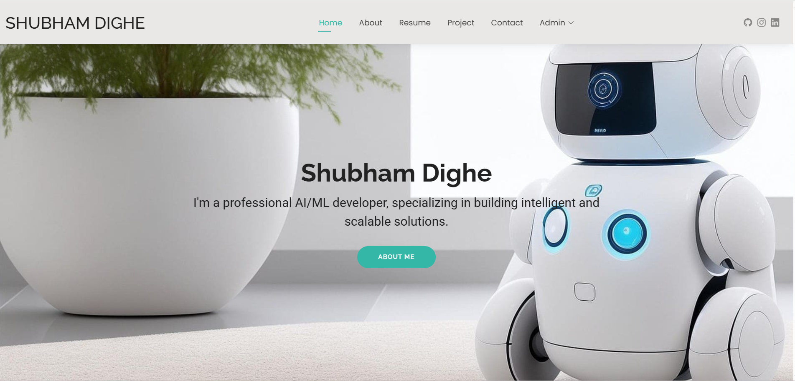
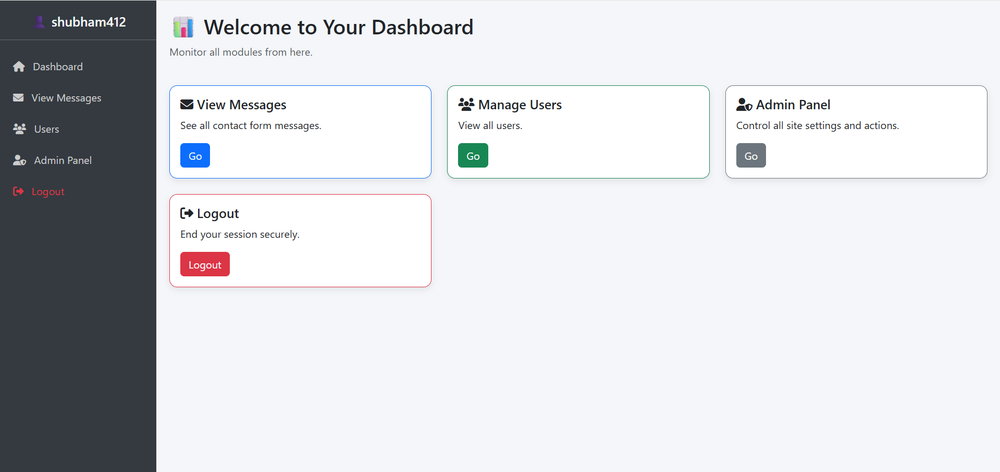

# 🌐 Personal Portfolio (PHP + MySQL)


This is my **personal portfolio website** built using **PHP, MySQL, HTML, CSS, Bootstrap, and JavaScript**.  
It highlights my work, skills, and resume, and includes a **backend tracking system** to monitor visitors.

---

## 🚀 Features

### 🖥️ Portfolio Pages
- 🏠 **Home Page** – Introduction and highlights  
- 👨‍💻 **About Me** – Education & experience  
- 📂 **Projects** – Detailed showcase of my work  
- 🛠️ **Skills** – Technical skills and tools  
- 📄 **Resume** – Downloadable PDF  
- 📬 **Contact Form** – Direct messaging  

### ⚙️ Backend Visitor Tracking
- 🔎 Logs **visitor details** (IP, browser, device info)  
- 📑 Tracks **visited pages**  
- 📥 Records **resume downloads**  
- ⏱️ Monitors **time spent on site**  
- 🔄 Tracks **total visits & last seen**  
- 📊 Stores analytics data in **MySQL**  

---

## 📊 Example Visitor Analytics

| Visitor IP       | Pages Visited         | Resume Download | Total Visits | Last Seen       |
|------------------|----------------------|-----------------|--------------|-----------------|
| 115.247.104.226  | Home, Projects, Contact | ✅ | 5 | Sept 7, 2025 |
| 192.168.1.45     | Home, About          | ❌ | 2 | Sept 6, 2025 |

---

## 🛠️ Tech Stack
- **Frontend:** HTML, CSS, JavaScript, Bootstrap  
- **Backend:** PHP (Core PHP)  
- **Database:** MySQL  
- **Tools & Libraries:**  
  - PHP Sessions for tracking  
  - Chart.js (optional for analytics visualization)  
  - IP geolocation APIs (optional)  

---

## ⚙️ Installation & Setup

1. **Clone Repository**
   ```bash
   git clone https://github.com/ShubhamMaster/Personal-Portfolio.git
   cd Personal-Portfolio

   ## 📸 Screenshots  

  
  

## 🔗 Live Demo  

👉 [Visit My Portfolio](https://shubhamresume.wuaze.com)  

## 📧 Contact  

- 📩 Email: [shubhamdighe45@gmail.com](mailto:youremail@example.com)  
- 💼 LinkedIn: [Linkedin Profile](https://linkedin.com/in/shubhamdighe)  
- 🐙 GitHub: [@ShubhamMaster](https://github.com/shubhammaster)  

